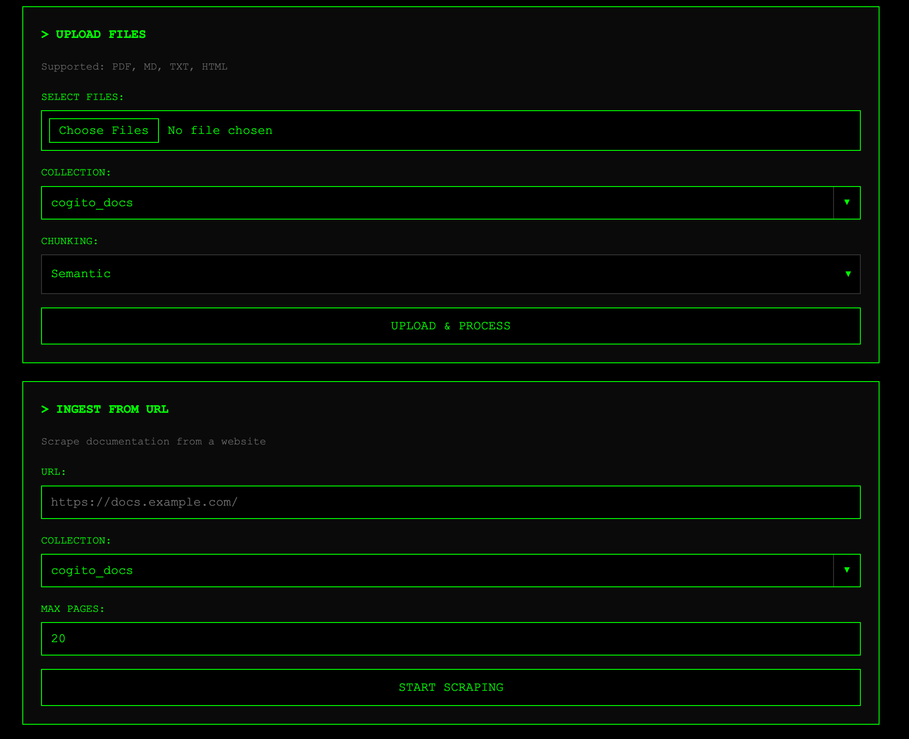
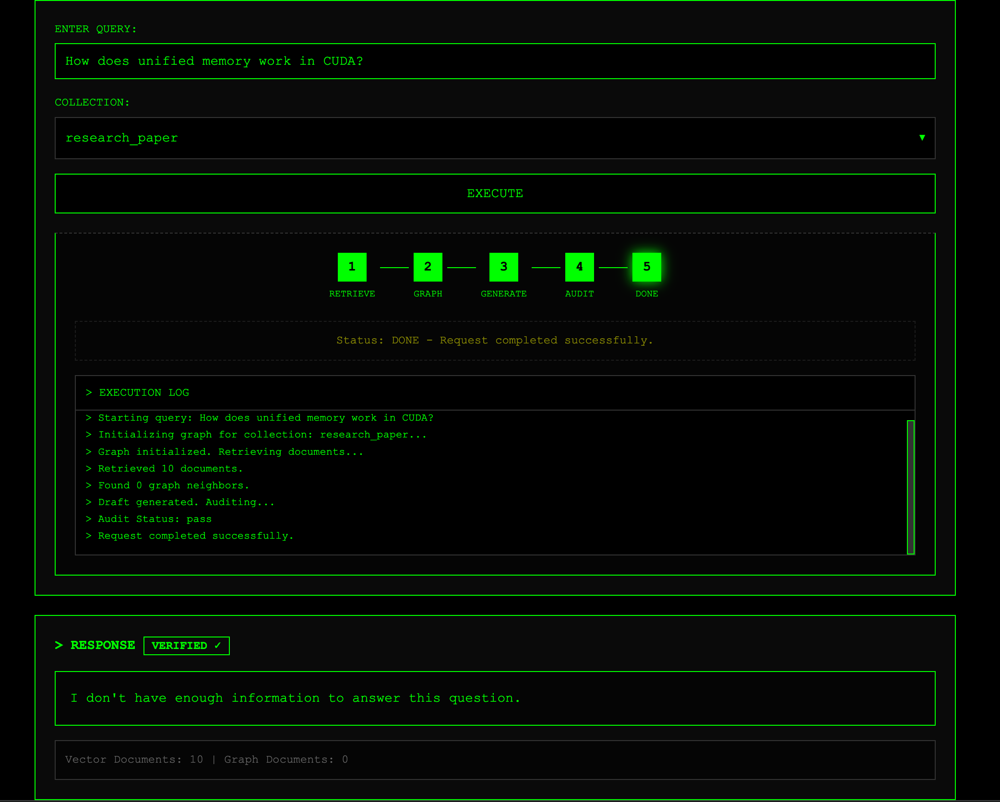
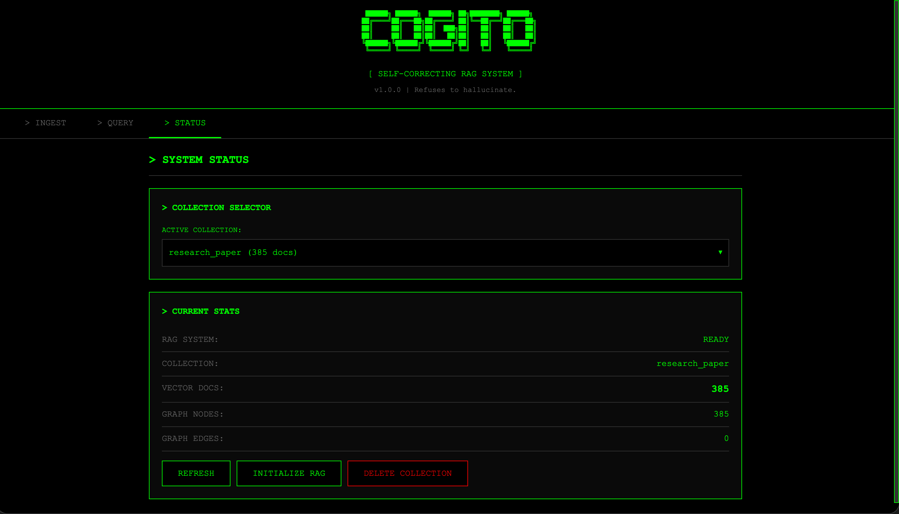

# COGITO - Self Correcting RAG

> *"The first principle is that you must not fool yourself — and you are the easiest person to fool."* — Richard Feynman


## ✨ Key Features

- **Self-Correcting Pipeline** — Automatically detects and rewrites hallucinated responses
- **Graph-Augmented Retrieval** — Follows document relationships to gather complete context
- **Hallucination Auditing** — Every response is verified against source documents
- **Local LLM Support** — Runs entirely on your machine using quantized models (GGUF)
- **Docker Support** — Fully containerized with optimized ~500MB image
- **One-Click Model Download** — Download both LLM and embedding models from the web UI
- **Multi-Format Ingestion** — Supports PDFs, Markdown, TXT, HTML, and web scraping
- **Collection Management** — Organize documents into separate searchable collections
- **Interactive Web UI** — Built-in terminal-style interface for querying and document management
- **Auto-scroll & Progress Tracking** — Real-time feedback with automatic UI cleanup

---

## The Problem with Parrots
You see, standard language models are a bit like very well-read parrots. You ask them, "What is the capital of France?" and they say "Paris!" because they've heard it a million times. It's wonderful.

But if you ask them something trickier, something technical like "How do I configure the memory pool in CUDA 12.1?"... well, sometimes they just *guess*. They put words together that sound right, like a parrot mimicking a scientist. But the parrot doesn't understand physics! It just knows the rhythm of the words. In our business, we call this a "hallucination," but really, it's just confident guessing.

And that is a catastrophe if you are trying to build software. You don't want a guess; you want the truth.

## Trust but Verify
So, how do we fix this? We don't just make the brain bigger. We change how it thinks. We build a machine that acts less like a parrot and more like a scientist.

A scientist doesn't just blurt out the first thing that comes to mind. A scientist does research. They look things up. They check their sources. And—this is the most important part—if the facts don't match their theory, they throw the theory out and start again.

**Cogito** is a "Self-Correcting Graph RAG." That's a fancy name for a simple three-step process:
1.  **Draft** an answer based on what we read.
2.  **Audit** that answer to see if it's actually supported by the text.
3.  **Rewrite** it if we were lying.

## How It Works (The Machinery)
We don't use a straight line for this. A straight line is "Retrieval -> Generation -> Done." That's the old way. We use a **Loop**.

Imagine a room with four people in it:

### 1. The Researcher (`RetrieveNode`)
This fellow runs to the library (our Vector Database) and grabs a handful of books that look relevant. "Here!" he says, "This book mentions CUDA memory!"

### 2. The Connector (`GraphAugmentNode`)
This one is clever. She knows that knowledge is connected. If the Researcher brings a page about "Function A," she says, "Wait a minute, you can't understand Function A without knowing about its Parameters, which are on *this other page*." She follows the links (the Graph) and grabs the extra context the Researcher missed.

### 3. The Writer (`GenerateNode`)
He takes all these pages and writes a draft answer. "Based on this text, you configure the memory pool like this..."

### 4. The Auditor (`AuditNode`) - The Most Important Person
This is our strict professor. He looks at the Writer's draft, and he looks at the source text, and he asks one question: *"Can you prove it?"*

If the Writer says "X is true," but the text doesn't say that, the Auditor slams his hand on the table. **"FAIL!"** he says. "Go back and do it again!"

And so, the Writer has to rewrite the query, the Researcher goes back to the library, and they try again. They keep trying until they get it right, or until they admit they just don't know.

## The Parts List (Tech Stack)
To build this machine, we used some very specific tools:

*   **LangGraph**: This is the conductor. It manages the state—who speaks when, and who passes papers to whom. It turns our flowchart into code.
*   **ChromaDB**: The filing cabinet with built-in ONNX embeddings. It stores the text chunks so we can find them by meaning (vector search) without needing PyTorch.
*   **NetworkX**: The map. It remembers how documents link to each other (hyperlinks, sections). This is how we find the "hidden" connections.
*   **Llama.cpp**: The brain. We're using local, quantized models (like Mistral 8B) because you don't need a supercomputer to check facts—you just need a sharp one.
*   **FastAPI**: The web server. Clean, fast, and modern API with background task support for async operations.
*   **Docker**: The container. Everything runs in an optimized ~500MB image with persistent volumes.

## Requirements

### Supported Operating Systems
| OS | Status |
|----|--------|
| **macOS** | ✅ Fully supported (Apple Silicon) |
| **Linux** | ✅ Fully supported (Ubuntu 20.04+, Debian, Fedora) |

### Hardware Requirements
| Component | Minimum | Recommended |
|-----------|---------|-------------|
| **GPU** | 8GB VRAM (with 3B model) | 16GB+ VRAM (for 8B model) |
| **RAM** | 16GB | 32GB |
| **Storage** | 10GB free space | 20GB+ (for multiple models) |
| **CPU** | 4 cores | 8+ cores |

> [!NOTE]
> The system can run on CPU-only mode, but inference will be significantly slower. Apple Silicon Macs with Metal support work well with `llama.cpp`.

### Software Requirements
| Software | Version | Purpose |
|----------|---------|---------|
| **Python** | 3.11+ | Runtime environment |
| **Conda/Miniconda** | Latest | Environment management |
| **CUDA Toolkit** | 12.x (if using NVIDIA GPU) | GPU acceleration |
| **Git** | Latest | Repository cloning |
| **C++ Compiler** | GCC 11+ / Clang 14+ | Building llama.cpp bindings |

> [!TIP]
> On macOS, install Xcode Command Line Tools via `xcode-select --install` for the C++ compiler.

## The Blueprints (Technical details)
For those who want to see the engine block, here is how we wired it up.

### 1. The Map Legend (Graph Schema)
When we say "Graph," we don't mean a pretty picture. We mean a specific data structure in `NetworkX`.
*   **Nodes**: represent distinct *chunks of knowledge*.
    *   `ID`: The file path or header (e.g., `docs/cuda_api.html#memory-pool`).
    *   `Content`: The actual text.
    *   `Type`: Is it a Code Block? A Concept? A Warning?
*   **Edges**: represent *relationships*.
    *   `PARENT_OF`: A section header owns its paragraphs.
    *   `LINKS_TO`: An HTML hyperlink found in the text.
    *   `MENTIONS`: If chunk A talks about "Texture Memory," and chunk B defines it.

### 2. The Professor's Rubric (Audit Logic)
The **Auditor** (`AuditNode`) isn't magic; it's a prompt with a very low temperature (`0.0`). We don't want creativity here; we want cold, hard logic.
The logic flows like this:
1.  **Extract Claims**: "The draft says: *'Use cudaMallocManaged for unified memory.'*"
2.  **Verify**: Search the retrieved context for that exact rule.
3.  **Verdict**:
    *   **PASS**: The text explicitly supports the claim.
    *   **FAIL**: The text contradicts it, or is silent.

### 3. The Lab Layout (Project Structure)
Here is where we keep everything. I've labeled the important bits.

```text
Cogito/
├── config/                 # Configuration files
│   └── paths.py            # Path constants (Model paths, DB paths)
├── data/                   # The Raw Materials (PDFs, HTML)
├── models/                 # The Brains (GGUF files go here)
│   └── onnx_cache/         # ONNX embedding models cache
├── db/                     # Database Storage
│   ├── chroma/             # Vector database (ChromaDB)
│   └── graph/              # Graph database (NetworkX pickles)
├── scripts/
│   ├── evaluate.py         # Run evaluation metrics
│   └── ingest.py           # CLI tool for ingestion (Scrapes & Indexes data)
├── src/
│   ├── db/                 # Database Interfaces
│   │   ├── graph_store.py  # NetworkX wrapper (saves/loads pickle)
│   │   └── vector_store.py # ChromaDB wrapper
│   ├── evaluation/
│   │   ├── evaluator.py    # DeepEval integration logic
│   │   └── metrics.py      # Custom faithfulness/hallucination metrics
│   ├── frontend/
│   │   └── app.py          # FastAPI server with web UI
│   ├── ingestion/
│   │   ├── parser.py       # Chunking & Node creation logic
│   │   ├── pipeline.py     # Orchestrates scraping -> graph -> db
│   │   └── scraper.py      # Fetches raw documentation
│   ├── nodes/              # The Workers (LangGraph Nodes)
│   │   ├── audit.py        # The Professor (Hallucination Checker)
│   │   ├── generate.py     # The Writer (Drafts answers)
│   │   ├── graph_augment.py# The Connector (Expands context)
│   │   ├── retrieve.py     # The Researcher (Vector Search)
│   │   └── rewrite.py      # The Editor (Fixes bad queries)
│   ├── graph.py            # The Conductor (The State Machine definition)
│   └── state.py            # The Data Schema (GraphState TypedDict)
└── utils/                  # The Wrenches
    ├── custom_exception.py
    └── logger.py           # Centralized logging
```

## Installation & Setup

First, get the code:
```bash
git clone "https://github.com/Kabyik-Kayal/Cogito.git"
cd Cogito
```

### Option 1: Docker (Recommended)

The fastest way to get started:

```bash
# Build and start the container
docker compose up --build -d

# Access the web UI
open http://localhost:8000
```

**Download the models:**
1. Open http://localhost:8000
2. Click the "MODEL" button in the top-right corner
3. Wait for the download to complete:
   - **Embedding model** (~80MB, 2-10%) - Downloads via ChromaDB AWS S3
   - **LLM model** (~9GB, 10-100%) - Downloads from HuggingFace
4. The button will show "MODEL READY" when both models are downloaded

That's it! Both models persist in Docker volumes across restarts:
- **LLM**: Stored in `/app/models` volume
- **ONNX Embeddings**: Stored in `/app/models/onnx_cache/chroma` via symlink to ChromaDB cache

**Useful Docker commands:**
```bash
# View logs
docker compose logs -f cogito

# Stop the container
docker compose down

# Restart after code changes
docker compose up --build -d

# Access container shell
docker exec -it cogito sh

# Check disk usage
docker system df -v
```

### Option 2: Local Python Setup (Recommended for Mac)

For development or if you prefer running directly on your machine:

```bash
# Create virtual environment
python -m venv venv
source venv/bin/activate  # On Windows: venv\Scripts\activate

# Install dependencies
pip install -r requirements.txt

# Start the application
uvicorn src.frontend.app:app --reload --host 0.0.0.0 --port 8000
```

Then open http://localhost:8000 in your browser.

## Using Cogito

### Initial Setup
On first launch, download the models:
1. Open the web interface at http://localhost:8000
2. Click the **MODEL** button in the top navigation
3. Wait for the download to complete:
   - ONNX embedding model (~80MB, downloads first at 2-7%)
   - LLM model (~9GB, downloads at 10-100%)
4. The button will change to **MODEL READY** when complete

### Document Ingestion

You can upload documents into the database or provide links to scrape data.



**Supported formats:** PDF, Markdown (`.md`), plain text (`.txt`), HTML

**Ingestion methods:**
- **File Upload:** Drag and drop or select files from your computer
- **URL Scraping:** Provide a URL to scrape and ingest web content
- **Collections:** Organize documents into separate searchable namespaces

Progress feedback is shown in real-time and auto-hides after 20 seconds.

### Querying

When you ask a question, watch the logs. You will see the **Audit** happen. You will see it **Fail**. And you will see it **Correct Itself**. Or answer explicitly that it **Lacks** the information to answer, instead of **Hallucinating**.



It is a beautiful thing to watch a machine admit it was wrong.

The page auto-scrolls to the bottom when generation completes, ensuring you see the full answer.

### Collection Management

You can also find the info of the available Collections, initialize them before hand to reduce the first query time, or delete the collections completely.



**Collection operations:**
- **List:** View all available collections and their document counts
- **Initialize:** Pre-load collection into memory for faster queries
- **Delete:** Remove a collection and all its documents permanently

## Configuration

Cogito is configured via the `config/paths.py` file:

| Setting | Description | Default |
|---------|-------------|---------|
| `MODEL_DIR` | Directory for LLM models | `models/` |
| `ONNX_CACHE_DIR` | ONNX embedding model cache | `models/onnx_cache/` |
| `CHROMA_DB_DIR` | ChromaDB persistence directory | `db/chroma/` |
| `GRAPH_STORE_DIR` | NetworkX graph storage | `db/graph/` |
| `DATA_DIR` | Document storage | `data/` |

### Docker Volumes

When running in Docker, data persists in named volumes:

| Volume | Mount Point | Purpose |
|--------|-------------|---------|
| `cogito_models` | `/app/models` | LLM (9GB) and ONNX embedding models (80MB) with symlinked cache |
| `cogito_db` | `/app/db` | ChromaDB vector storage and NetworkX graph data |
| `cogito_data` | `/app/data` | Uploaded documents and scraped content |

> [!NOTE]
> The ONNX embedding model uses a symlink from `~/.cache/chroma/onnx_models` to `/app/models/onnx_cache/chroma` to ensure ChromaDB finds the model while keeping it in the persistent Docker volume.

**To inspect volumes:**
```bash
# List all volumes
docker volume ls

# See where data is stored on host
docker volume inspect cogito_models

# Check model files
docker exec cogito ls -lh /app/models
```

### Customization

Edit `config/paths.py` to change paths, then rebuild if using Docker:
```bash
docker compose up --build -d
```

## Troubleshooting

### Common Issues

| Issue | Solution |
|-------|----------|
| **Out of Memory (GPU)** | Use a smaller model (3B) or reduce `n_ctx` in generate.py |
| **Slow inference** | Ensure GPU acceleration is enabled; check Metal/CUDA setup |
| **Model not found** | Click the "MODEL" button in the web UI to download both models |
| **ChromaDB errors** | Delete `db/chroma/` directory and re-ingest documents |
| **Port 8000 already in use** | Change port in docker-compose.yml or kill the process using the port |
| **Docker build fails** | Ensure you have at least 10GB free disk space; try `docker system prune` |
| **ONNX model re-downloads** | Model should persist via symlink; check `/app/models/onnx_cache/chroma` exists |
| **Container won't start** | Check logs with `docker compose logs cogito` |
| **Ingestion hangs** | Check browser console for errors; progress auto-hides after 20 seconds on success |

### Docker-Specific Issues

```bash
# Container keeps restarting
docker compose logs cogito --tail=50

# Clean rebuild (removes volumes - WARNING: deletes data!)
docker compose down -v
docker compose up --build

# Free up Docker disk space
docker system prune -a

# Check resource usage
docker stats cogito
```

## API Reference

The web interface runs on `http://localhost:8000`. Key endpoints:

| Endpoint | Method | Description |
|----------|--------|-------------|
| `/` | GET | Main web interface |
| `/api/status` | GET | System status and collection info |
| `/api/query` | POST | Submit a question (returns job_id) |
| `/api/query-status/{job_id}` | GET | Get query progress and results |
| `/api/upload` | POST | Upload documents (PDF, MD, TXT, HTML) |
| `/api/upload-status/{job_id}` | GET | Check upload progress |
| `/api/ingest-url` | POST | Scrape and ingest from URL |
| `/api/ingestion-status/{job_id}` | GET | Check URL ingestion progress |
| `/api/collections` | GET | List all collections |
| `/api/delete-collection` | DELETE | Remove a collection |
| `/api/download-model` | POST | Download LLM and ONNX models |
| `/api/model-status` | GET | Check if models are downloaded |

## Performance & Optimization

### Docker Image Size
The Cogito Docker image is highly optimized at **~700MB** (compressed).

### Inference Performance
| Backend | Hardware | Speed | Tokens/sec |
|---------|----------|-------|------------|
| **Metal** | Apple M1/M2/M3 | Fast | 40-60 |
| **CUDA** | NVIDIA RTX 3090 | Very Fast | 60-80 |
| **CPU** | Intel i7/i9 | Slow | 5-10 |

> [!TIP]
> For faster inference, ensure your GPU drivers are up to date and that the container has access to GPU resources.

## Contributing

Contributions are welcome! Here's how to get started:

1. Fork the repository
2. Create a feature branch (`git checkout -b feature/amazing-feature`)
3. Commit your changes (`git commit -m 'Add amazing feature'`)
4. Push to the branch (`git push origin feature/amazing-feature`)
5. Open a Pull Request

## License

This project is licensed under the [MIT License](LICENSE).

## Acknowledgments

- Built with [LangGraph](https://github.com/langchain-ai/langgraph) for state machine orchestration
- [ChromaDB](https://www.trychroma.com/) for vector storage with ONNX embeddings
- [llama.cpp](https://github.com/ggerganov/llama.cpp) for local LLM inference
- [FastAPI](https://fastapi.tiangolo.com/) for the web server
- [NetworkX](https://networkx.org/) for graph operations
- Model: [Mistral Ministral-3-8B-Reasoning](https://huggingface.co/mistralai/Ministral-3-8B-Reasoning-2512-GGUF)

---
*"Nature cannot be fooled."*
